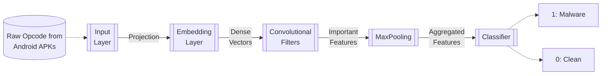

# Lesson 5. Introduction to Neural Networks for Malware Detection

## Why use Neural Networks for Malware Detecion?

Using neural networks for malware detection is useful because they learn from experience to identify and catch malware more efficiently over time. In the context of modern cybersecurity, where threats are continually evolving and becoming more sophisticated, neural networks offer a dynamic and powerful tool for staying ahead of malicious activities. They contribute to a more proactive and adaptive security posture, enhancing the ability to detect and respond to novel and complex malware threats. Another reasons are:

- **Speed and Scalability**: Traditional manual malware analysis is slow and not scalable due to the rapid increase in malware varieties.
- **Automated Learning**: Neural networks automate the process of feature detection and classification, bypassing the need for manually crafted malware signatures. This is particularly beneficial in large-scale systems where manual analysis of every threat is impractical.
- **Efficiency**: These models can run efficiently on GPUs, making them suitable for real-time applications, including mobile platforms. Once trained, neural networks can analyze new software quickly and efficiently.

## Heuristic Approach

The heuristic approach in malware detection is like having a set of rules or guidelines that help identify potentially malicious software based on certain characteristics or behaviors. Instead of relying on specific signatures or patterns of known malware, heuristic analysis looks at the behavior of programs to determine if they might be harmful.

- **Pre-processing**: Involves decompiling Android APK files to Dalvik bytecode and simplifying the code to opcode sequences.
- **Data Preparation**: The network learns to recognize malicious patterns from a dataset of labeled malware and benign application samples.

### Risks and Limitations

Programs are given a score based on how closely they match the predefined rules. If a program's behavior matches a lot of the rules, it's more likely to be flagged as malware.
Based on the score, the program is classified as either benign or potentially malicious. If it's considered risky, further investigation or action may be taken, such as quarantining the program or alerting the user.
We can find the following risks and/or limitations:

* **False Positives**: Heuristic analysis can sometimes incorrectly flag harmless programs as malware, leading to false positives.
* **Detection Evasion**: Malware developers continuously evolve their methods to bypass detection by such neural networks.
* **Overhead**: Heuristic analysis can be resource-intensive, as it requires analyzing program behavior in real-time, which can slow down system performance.

## Network Architecture for Malware Detection

### Basic Components of the Network
1. **Input Layer**: Takes raw opcode sequences from Android APKs.
2. **Embedding Layer**: Transforms opcode integers into dense vectors that capture semantic meanings (characteristics) of the opcodes.
3. **Convolutional Layers**: These layers apply multiple filters to the embedded vectors to detect various features and patterns indicative of malware.
4. **Max Pooling Layer**: Aggregates the features detected by convolutional filters to reduce dimensionality and focus on the most salient features.
5. **Classification Layer**: Makes the final decision on whether an APK is malicious based on the features extracted by previous layers.

### Deep Learning Model Training and Evaluation

#### Dataset
- **Composition**: Consists of approximately 10,000 Android malware samples and 10,000 benign applications.
- **Source**: Malware samples provided through collaboration with antivirus companies like McAfee Labs.
- **Training and Testing Split**: 90% of data is used for training the model, while 10% is reserved for testing to evaluate model performance on unseen data.

#### Training Process
- **Objective**: Minimize the difference between predicted and actual classifications (malware or benign).
- **Loss Function**: Binary Cross-Entropy, which penalizes the classification errors during training.

