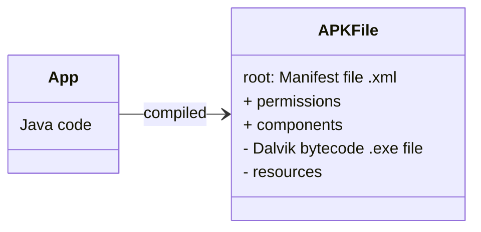
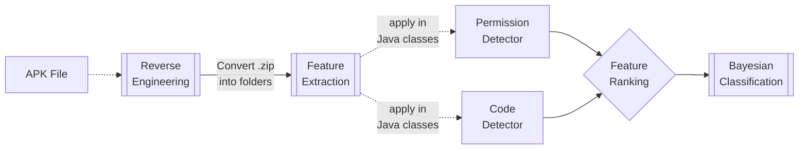

# Lesson 6. Android Malware Detector

## The Necessity of Machine Learning in Malware Detection
Manual analysis of malware is time-consuming and costly, especially with the exponential growth in the number of applications. Machine learning offers a scalable, cost-effective solution to automate the detection process.

## Understanding Android System Architecture

Android is built specifically for mobile devices that might not have a lot of resources (like memory and processing power). It uses a customized version of the Linux operating system to manage hardware resources efficiently.

### Apps in Android 

Each app in Android runs in its own secure environment, called a _sandbox_, using something called the Dalvik Virtual Machine (DVM). This helps keep the rest of the system safe from potential malicious actions by an app.

* Apps are primarily written in Java.
* They are compiled into a package called an _APK file_, which contains all the code and resources the app needs to run.
* Every app must have a _manifest file_ at its root, which tells the Android system what the app components are and what permissions the app needs (like internet access).

## The Process of Malware Detection

1. **Reverse Engineering**: Decompile APK files to extract the source code and other elements. This involves converting Dalvik bytecode back into Java code, analyzing this code to identify risky API calls, permissions, and other suspect activities.
2. **Feature Extraction**: From the decompiled code, identify specific features or properties, like certain API calls or permissions used by the app. These features are encapsulated in a _feature vector_.
3. **Feature Selection**: Using techniques like mutual information, identify the most informative features that help distinguish between benign and malicious apps.
4. **Classification**: Train a classifier (e.g., a Bayesian classifier) on labeled data (malicious and benign samples) using the selected features. The classifier learns to predict whether an unseen app is likely to be malicious based on its features.

## Detailed Steps in the Malware Detection Process
- **App Property Detectors**: These tools (permission and code detectors) are used to detect specific properties within the app code that are typically associated with malware.
- **Code and Permission Detectors**: These specifically look for risky permissions requested by the app and potentially harmful API calls.
- **Feature Ranking and Selection**: Rank features based on their relevance and select the most significant ones to use for malware detection.

### Top selected features and their frequencies in sets of 1000 samples in each category

| Features                             | Benign | Malware |
|--------------------------------------|--------|---------|
| getSubscriberId (TelephonyManager)   | 42     | 742     |
| getDeviceId (TelephonyManager)       | 316    | 854     |
| getSimSerialNumber (TelephonyManager)| 35     | 455     |
| .apk (secondary payload)             | 89     | 537     |
| intent.action.BOOT_COMPLETED         | 69     | 482     |
| chmod (system command)               | 19     | 389     |
| Runtime.exec() (Executing process)   | 62     | 458     |
| abortBroadcast (intercepting broadcast notifications) | 4 | 328 |
| getLine1Number (TelephonyManager)    | 111    | 491     |
| /system/app                          | 4      | 292     |
| /system/bin                          | 45     | 368     |
| createSubprocess (creating child process) | 0 | 169     |
| getSimOperator (TelephonyManager)    | 37     | 196     |
| remount (system command)             | 3      | 122     |
| DexClassLoader (stealthily loading a class) | 16 | 152    |
| pm install (installing additional packages) | 0 | 98      |
| getCallState (TelephonyManager)      | 10     | 119     |
| chown (system command)               | 5      | 107     |
| .jar (secondary payload)             | 87     | 252     |
| mount (system command)               | 29     | 152     |
| KeySpec (code encryption)            | 99     | 254     |
| /system/bin/sh                       | 4      | 90      |
| SMSReceiver                          | 3      | 66      |
| getNetworkOperator (TelephonyManager)| 202    | 353     |
| SecretKey (code encryption)          | 119    | 248     |

## Feature Ranking

We want to know how useful each feature is. We do this by calculating their **Mutual Information (MI)** score. MI measures how much one random variable tells us about another i.e. _How much does seeing Feature $F_{1}$ _tells us about the probability this sample is malware or benign?_ Then we can pick the most important features to use as input to our classifier.

$$
MI(R_i, C) = \sum_{r=0}^{1} \sum_{c \in \{mal, ben\}} P(R_i = r) P(C = c \mid R_i = r) \log_2 \left( \frac{P(C = c \mid R_i = r)}{P(C = c)} \right)
$$

where:

* $r$ denotes the feature
    * $1$ The feature occurs
    * $0$ The feature does not occur

* $c$ denotes the class malware ($M$) or benign ($B$)

Be careful! MI is computed using base 2 log, so that information can be expressed in bits. Most calculators don’t directly support base 2 log. Assuming our calculator supports base 10 log, we can use the change of base formula to calculate the base 2 log for $x$ as follows:

$$\log_{2} (x) = \dfrac{\log_{10}(x)}{\log_{10}(2)}$$

### Example of Feature Ranking

Let the feature `getSubscriberID` be choosen for this exercise, having a benign frequency of $42/1000$ and a malware frequency of $742/1000$.

1. Calculate the probability that `getSubscriberID` occurs in both malware and benign code.

    * For $P(R_{i}=1)$
        * Total number of times it occurs is $742+42=784$
        * Total number of code samples is $2000$
        * Then $P(R_{i}=1)=784/2000=0.39$

    *  For $P(R_{i}=0)$
        * Total number of times it does not occur is $2000-742-42=1216$
        * Total number of code samples is $2000$
        * Then $P(R_{i}=0)=1216/2000=0.61$

2. Calculate all probabilities for $P(R_i = r) P(C = c \mid R_i = r)$:

    * $P(C=M \mid R_{i}=1)=742/784=0.95$
    * $P(C=B \mid R_{i}=1)=42/784=0.05$
    * $P(C=M \mid R_{i}=0)= (1000-42)/(958 + 1000-742) = 0.79$
    * $P(C=B \mid R_{i}=0)= 1-P(C=M \mid R_{i}=0)= 0.21$

3. There are $1000$ samples of malware and $1000$ samples of benign, that is:

    * $P(C = M) = 1000 / 2000 = 0.5$
    * $P(C = B) = 1000 / 2000 = 0.5$

4. Finally,

A cheatsheet for the MI equation would be:

| Concept                          | Meaning | Equation |
|--------------------------------------|-------- |----------|
| $f_{M}$ | Frequency of malware |  $\dfrac{\text{Number of files containing malware code}}{\text{Number of total files}}=\dfrac{n_{M}}{m_{M}}$ |
| $f_{B}$ | Frequency of benign |  $\dfrac{\text{Number of clean files}}{\text{Number of total files}}=\dfrac{n_{B}}{m_{B}}$ |
| $m$ | Total number of code samples | $n=m_{B}+m_{M}$ |
| $P(R_{i}=1)$                         | Probability of $R_{i}$ be happening in both malware and benign code | $\dfrac{\text{Total number of times it occurs}}{\text{Total number of code samples}}=\dfrac{n_{B}+n_{M}}{n}$ |
| $P(r_{i}=0)$ | Probability of $R_{i}$ not happening in both malware and benign code | $\dfrac{\text{Total number of times it does not occur}}{\text{Total number of code samples}}=\dfrac{n-n_{B}-n_{M}}{n}$ |
| $P(C=M \mid R_{i}=1)$                | Probability of the code be classified as malware if $R_{i}$ occurs | $\dfrac{\text{Total number of times it occurs in malware}}{\text{Total number of code samples containing }R_{i}}=\dfrac{n_{M}}{n_{M}+n_{B}}$ |
| $P(C=B \mid R_{i}=1)$                | Probability of the code be classified as clean if $R_{i}$ occurs | $\dfrac{\text{Total number of times it occurs in benign}}{\text{Total number of code samples containing }R_{i}}=\dfrac{n_{B}}{n_{M}+n_{B}}$ |
| $P(C=M \mid R_{i}=0)$                | Probability of the code be classified as malware if $R_{i}$ does not occur | $\frac{\text{Total number of times it does not occur in malware code}}{\text{Total number of code samples not containing } R_i} = \frac{m_M - n_M}{(m_B - n_B) + (m_M - n_M)}$|
| $P(C=B \mid R_{i}=0)$                | Probability of the code be classified as clean if $R_{i}$ does not occur | $\frac{\text{Total number of times it does not occur in benign code}}{\text{Total number of code samples not containing } R_i} = \frac{m_B - n_B}{(m_B - n_B) + (m_M - n_M)}$ |
| $P(C=M)$ | Probability of malware code | $\dfrac{m_{M}}{n}$ |
| $P(C=B)$ | Probability of clean code | $\dfrac{m_{B}}{n}$ |

## Bayesian Classification
The Bayesian classifier calculates the likelihood of an app being malicious based on the probability distributions of the features in malicious and benign apps. It uses these probabilities to make a decision about the nature of the app.

$$
P(C = c \mid R = r) = \dfrac{P(C = c) \cdot \prod_{i=1}^n P(R_i = r_i \mid C = c)}{\sum_{j=0}^1 P(C = c_j) \cdot \prod_{i=1}^n P(R_i = r_i \mid C = c_j)}
$$

where:

* $r$ is a feature vector of length $n$
* $C$ is the class benign ($B$) or malware ($M$)

### Example Bayesian Classification

For a given test sample the following features are detected:

* **getSubscriberID $\rightarrow$ detected**
* getDeviceId
* **getSimserialNumber $\rightarrow$ detected**
* .apk
* **Chmod $\rightarrow$  detected**

Our feature vector is therefore $r=(1,0,1,0,1)$ where $1$ indicates a feature has been detected. Our feature vector i.e. random variable $R$ is equal to $r = (1,0,1,0,1)$, therefore:

* **Malware**: $P(M \mid R=r) = 0.74 \cdot 0.15 \cdot 0.45 \cdot 0.46 \cdot 0.39 = 0.01$ where...

    * $P(R_{1}=1 \mid C=M) = 742/1000 = 0.74$
    * $P(R_{2} =0 \mid C=M) = 1 -(854/1000) = 0.15$
    * $P(R_{3} =1 \mid C=M) = 455/1000 = 0.45$
    * $P(R_{4} =0 \mid C=M) = 1 -(537/100) = 0.46$
    * $P(R_{5} =1 \mid C=M) = 389/1000 =0.39$

* **Benign**: $P(B|R=r) = 0.04 \cdot 0.68 \cdot 0.04 \cdot 0.91 \cdot 0.02 = 0.00002$ where...

    * $P(R_{1}=1 \mid C=B) = 742/1000 = 0.04$
    * $P(R_{2} =0 \mid C=B) = 1 -(854/1000) = 0.68$
    * $P(R_{3} =1 \mid C=B) = 455/1000 = 0.04$
    * $P(R_{4} =0 \mid C=B) = 1 -(537/100) = 0.91$
    * $P(R_{5} =1 \mid C=B) = 389/1000 =0.02$

Because $P(M \mid R=r) \geq P(B \mid R=r)$ this sample is more likely to be malware than benign.

## Android Malware Detector

Feature vectors built from the top $25$ ranked features. Classifier is trained to classify apps into benign or malign and as more features are used, accuracy improves. 

- Android malware is growing in scale and complexity.

- Static analysis coupled with classifier is an effective tool
for filtering apps to detect unknown Android malware

- $>90$% detection rate obtainable with low false positives and higher detection rates are possible. Viable approach for filtering large amounts of apps added to Android market on daily basis (estimated $1200$ daily).

