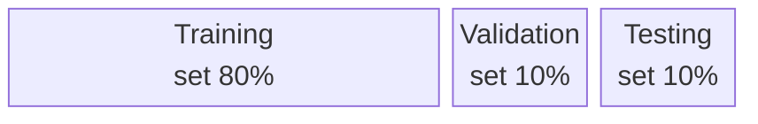

# Lesson 7. Building a real world malware detector

## Building a Machine Learning-Based Detector
1. **Collect Data:** Gather a dataset containing examples of both malware and clean software.
2. **Feature Extraction:** Identify and extract characteristics from the malware samples that can help differentiate between malicious and benign software.
3. **Train the Detector:** Develop a model specifically to recognize and classify malware.
4. **Test the Detector:** Evaluate the performance of the detector using realistic data to ensure it works effectively in real-world scenarios. Repeat these steps regularly to update the detector as new malware emerges.

## Dataset Collection and Management

Obtaining a high quality dataset is often the most important step in any machine learning project. The quality of the dataset will determine the quality of the detector. Larger datasets typically produce better detectors as a dataset with more variability allows a more robust detector to be learned.

- **Sources:** Malware datasets can be acquired from pre-made collections, honey-pots, or third-party app stores known for less stringent security checks.
- **Handling Malicious Apps:** Use dedicated, isolated systems to handle and store malicious applications to prevent contamination of other systems.

### Labeling and Testing
- **Labeling:** Determine which files are malware and which are benign, often using services like VirusTotal to get opinions from multiple antivirus scanners.
- **Testing Sets:** Divide the dataset into training, validation, and testing sets to train the model and evaluate its performance. Assign each example or instance from the data randomly to any of those three sets.

| Set            | Purpose                                       | Proportion |
|----------------|-----------------------------------------------|------------|
| Training set   | Learn the parameters of the model             | 80%        |
| Validation set | Check model performance during training       | 10%        |
| Testing set    | Check how well model generalises to unseen data | 10%      |

## Feature Extraction

**Features:** are measurable properties of the data which could include strings, DLL imports, function call graphs, network activity, etc. Select features that are relevant to the specific malware detection task.

1. **Which feature types would be best a coping with Packed Malware?**
    * Dynamic run time features / behavioural features / network activity
these features are based on activity of running malware after unpacking.

2. **Which feature types would be best a coping with Obfuscated Malware?**
    * Imports of DLLs, behavioural features, permissions etc. These features are not affected by changes to the sequence of instructions in the malware.

**Strengths and Weaknesses:** Not all features are equally useful, and some are better at coping with certain malware traits like packed or obfuscated malware.

## Zero-Day Malware

Zero-Day Malware refers to malware exploiting unknown vulnerabilities, making them difficult to detect because they don't match any existing signatures. Also, anti virus may not be aware of this type of attack and because there is no previous examples of malware source code/binaries available, is harder to design defences against an unknown threat.

### Machine Learning for Zero-Day Malware

**Behavioural analysis** can help to detect zero day malware, that is, using machine learning models, which can be performed in emulator or live system and can extract features from the malware behaviour.

- **Adversarial Attacks:** Techniques that manipulate the input $^{1}$ to a malware detector in subtle ways that cause the model to classify malicious software as benign. For example, by introducing designed noise to the input image. ML models are sensitive to adversarial attacks as decision in the network changes from one class to another with very high confidence.

- **Concept Drift:** The nature of malware changes over time, requiring continuous updates to the model.

- **Interpretable Models:** Sometimes, machine learning models can produce very accurate malware classifiers, i.e., neural networks. The problem is that usually those architechtures consists of huge networks with millions/billions of weights, so we don't know exactly how decisions are made. Such a neural network is said to be a _black box_. We must focus on developing models where the decision-making process is transparent, increasing trust and understanding of the model’s behavior.

$^{1}$ _Adversarial Examples_: Intentionally crafted inputs that cause the model to make errors, emphasizing the need for robust and adaptable detection systems.

