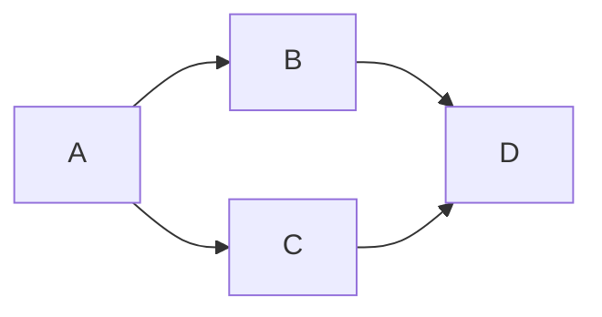
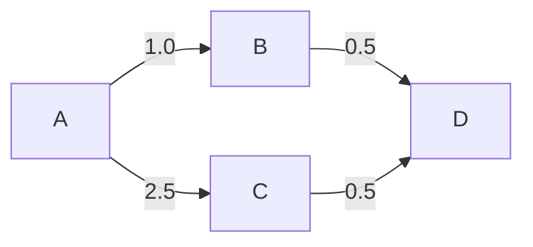
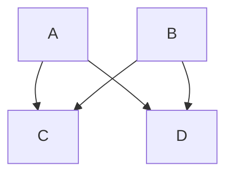
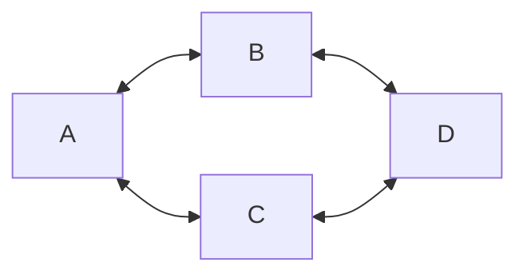
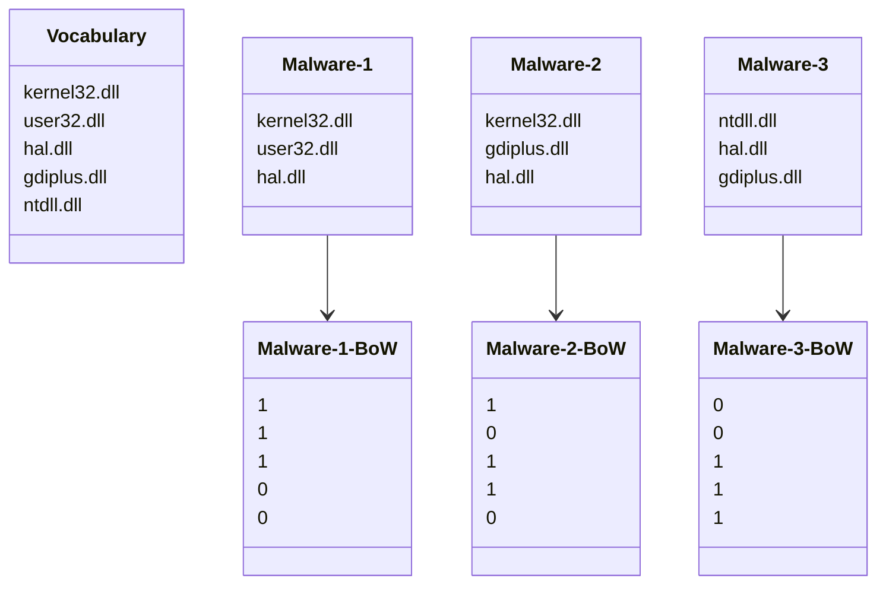

# Lesson 8. Graph Analysis for Cyber Attacks and Malware

## Understanding Malware Detection and Graph Analysis

### Network Analysis
Network Analysis helps understand how different malware samples are related by examining their shared attributes like IP addresses, hostnames, and code signatures. This analysis can uncover:
- Patterns or campaigns of cyber-attacks.
- Common tactics used by malware.
- Origins of malware infections.
- Command and control networks used by attackers.

By analysing the relationships between large numbers of malware samples we can obtain high level insights into malware datasets.

### Graphs in Malware Analysis

Graphs visually represent the relationships between objects. Graphs help identify clusters of related malware, making it easier to see how certain malware samples are connected.

- **Vertices (Nodes):** Represent objects like malware samples.
- **Edges:** Show relationships between these objects. For example, if two malware samples connect to the same IP address, they would be connected by an edge in a graph.



#### Atributtes

Can be used to enrich a graph. Both nodes and edge can have attributes.

* Edges commonly have a weight attribute. Greater weighting then indicates stronger connections between malware samples.
* Nodes also can have attributes e.g., file size of each malware sample.



#### Bipartite Graphs

Bipartite Graphs are a special type of graph where nodes are divided into two distinct groups without direct connections within the same group. For example, one group could be malware samples and the other could be domain names they connect to. A bipartite graph can be used to show shared attributes between malware samples.



### Graph Projections

This simplifies graphs by only showing connections based on shared attributes, like malware samples that connect to the same domain names. It helps analysts see the overall connections and potentially identify coordinated attack campaigns. In simple terms, they're a simpler version of a bipartite network.

* Useful when our graphs grow very large $\rightarrow$ we might want to see how malware samples are related, without having to closely inspect all connections.

## Visualizing Malware Graphs
Displaying graphs on screen for manual analysis can be challenging fue to different hardware and software implications. Ideally all nodes would be equally far apart. As the number of nodes increases it becomes impossible to satisfy this constraint and distortion must be introduced to display all nodes (**distorsion problem**).

- **Force-Directed Algorithms:** To minimize layout distortion when it comes to visualize malware graphs. Force-Directed Algorithms are a type of visualization technique used to arrange graphs (networks of nodes and edges) in a way that visually displays these connections clearly. You can think of them as simulating a physical system where nodes repel each other like magnets, while edges act like springs pulling connected nodes closer.



## Shared Code Analysis and Reverse Engineering

Shared Code Analysis (a.k.a. _code similarity analysis_) focuses on identifying and analyzing portions of code that are shared between different malware samples. Concretely, shared code analysis can be used to help with **reverse engineering** as it can help analyzing the malware sample from scratch to understand its construction and behavior.

* Reveals previously analysed code that is shared with other malware.
* No need to start analysis from scratch every time.
* May also help to uncover the person/organisation that deployed this malware.

```
Showing samples similar to WEBC2-GREENCAT_SAMPLE_23
Sample name                                                       Shared code
[*] WEB2-GREENCAT_sample_E54CE5F0112C9FDFE86DB17E85A5E2C5         0.9921875
[*] WEB2-GREENCAT_sample_55FB1409170C91740359D1D96364F17B         0.9921875
[*] GREENCAT_sample_55FB1409170C91740359D1D96364F17B              0.9921875
[*] WEB2-GREENCAT_sample_E83F60FB0E0396EA309FAF0AED64E53F         0.984375
   [comment] This sample was determined to definitely have come
   from the advanced persistent threat group observed last July
   on our West Coast network.
[*] GREENCAT_sample_E83F60FB0E0396EA309FAF0AED64E53F              0.984375
```

The output of shared code analysis can be represented as a graph. Helps to quickly identify malware families. Much faster than using manual analysis to perform the same task. These features might include:

1. _Static Features_: Such as strings, binary code patterns, or metadata from the malware files, which can be extracted without executing the malware.
2. _Dynamic Features_: Behavioral patterns observed when malware is executed in a controlled environment, like sequence of system calls, network activity, or changes made to the file system.

## Feature Extraction and Bag of Words 

Feature Extraction involves identifying useful data points (features) from malware binaries, like strings or dynamic API calls. The goal of feature extraction is to transform raw malware data into a structured format that is suitable for analysis.

### Bag of Words (BoW)

Bag of Words (BoW) A method to describe malware samples based on the presence or absence of pre-defined features, ignoring the order of features.
  
  - Simple and robust method of describing malware.
  - BoW features can be used for shared code analysis. BoW feature is a binary descriptor for presence/absence of import as it can be seen in the following class diagram.

To use Bag of Words (BoW) we have to...

1. **Specify a vocabulary**. The vocabulary describes all the features a malware sample can have / or just the features that are relevant to this task.
2. **Represent each malware sample**. Each sample described in terms of the features from the vocabulary are present in that sample.
3. **Specify a similarity function** for comparing malware samples based on their BoW features.



#### Jaccard Index

The Jaccard Index compares similarity of BoW features from different malware samples. It is a measure of the similarity between two sets and is defined as the size of the intersection divided by the size of the union of the sample sets.

$$
J(A, B) = \frac{|A \cap B|}{|A \cup B|}
$$

where:

* $|A \cap B|$ is the number of shared features between $A$ and $B$
* $|A \cup B|$ is the total number of features, present in $A$ or $B$


#### Similarity Matrices

Visual tools that display the similarity scores between multiple malware samples, helping identify related samples and clusters. Each box contains the similarity score between a pair of malware samples i.e. `M(i,j) = JaccardIndex sample_i,sample_j`.


|          | Sample 1         | Sample 2         | Sample 3         | Sample 4         |
|----------|------------------|------------------|------------------|------------------|
| Sample 1 | 1 | $M_{1,2}$ | $M_{1,3}$ | $M_{1,4}$ |
| Sample 2 | $M_{2,1}$ | 1 | $M_{2,3}$ | $M_{2,4}$ |
| Sample 3 | $M_{3,1}$ | $M_{3,2}$ | 1 | $M_{3,4}$ |
| Sample 4 | $M_{4,1}$ | $M_{4,2}$ | $M_{4,3}$ | 1 |


* The diagonal can be ignored as this simply compares each sample with itself.
* Top right and bottom left triangles of similarity matrix are the same i.e. the matrix is symmetric along the diagonal. Therefore, we only need to look at one corner of the matrix.

**Similarity Matrixes can be represented as graphs**:

  * If similarity (Jaccard Index) between pair of malware samples is greater than a threshold $\rightarrow$ Draw weighted edge between the malware samples.
  * The resulting graph will show clusters of related malware, such as distinct malware families.
  * This method of transforming similarity matrixes into graphs works well when we have small numbers of malware samples.
    * As number of samples increases, number of similarity comparisons grows as $0(n^{2})$
    * We need to use a different method: Randomized similarity comparison algorithm or Allows some error in computation in return for significantly reduced number of comparisons.
