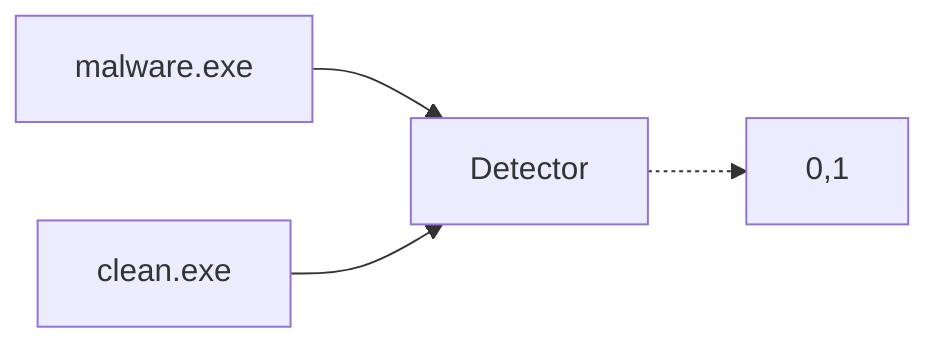
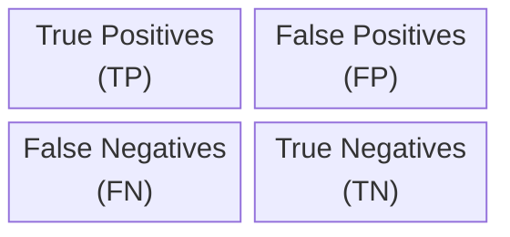
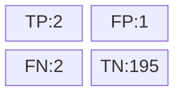

# Lesson 9. Evaluating Malware Detection Systems

## Skewed Datasets

Skewed dataset happen when the proportion of positive and negative examples in the dataset are not equal e.g. $95$% positive, $5$% negative. 

- Most computer files do not contain malware
- Most credit card transactions are legitimate
- Most people are not sick at any given time

### Accuracy doesn't work on skewed datasets

Accuracy is calculated as the percentage of total predictions that were correct, both true positives (correctly identified malware) and true negatives (correctly identified clean files).

$$Accuracy = \dfrac{\text{Number of correct predictions}}{\text{Number of total predictions}} \cdot 100$$

With a skewed dataset, the percentage classification accuracy cannot tell us how well a given classifier is working. For example, ee test the algorithm on $200$ files and the algorithm answers correctly on $199$ files (clean), and incorrectly on $1$ file (malware). What is this algorithm’s percentage accuracy? $199/200 = 99.5$% accuracy.

* **High Accuracy with Minimal Effort**: If $99$% of a dataset are clean files and a classifier naively classifies all files as clean, it will still achieve $99$% accuracy. This number sounds impressive at first but reveals nothing about the classifier's ability to actually detect malware, which is the whole point of the system.

* **Ignored Minority Class**: In the example above, the accuracy metric completely ignores how the system performs on the crucial minority class: malware. Even if the system fails to detect any malware at all, the high prevalence of clean files distorts the accuracy to appear favorable.

## Detection Outcomes

The classifier takes as input a file and predicts whether the file is malware / clean (in reality, it outputs the probability the file contains malware). For simplicity assume the malware detector outputs $1$ for malware or $0$ for clean.



There are $4$ unique combinations of malware/clean input label and malware/clean classifier predictions:

| File's True Label | Malware Detector's Prediction | Name          | Description                                      |
|-------------------|-------------------------------|---------------|--------------------------------------------------|
| Malware           | Malware                       | True Positive | File is malware and detector correctly predicts malware |
| Clean             | Malware                       | False Positive| File is clean, but detector incorrectly predicts malware |
| Malware           | Clean                         | False Negative| File is malware, but detector incorrectly predicts clean  |
| Clean             | Clean                         | True Negative | File is clean and detector correctly predicts clean       |


## Confussion Matrix

The confusion matrix lets us see many different aspects of the classifier’s performance. However interpreting this matrix is difficult to do at a glance. That's why we calculate various _summary statistics_ based on the confusion matrix. 



A proper confussion matrix for malware detection would be:


There are two cases where the system has made a mistake: False Positive (FP) and False Negative (FN). The reasons: 
- We often lack the true labels for real world files.
- Labels only available on smaller research datasets.
- Very expensive to produce correctly labelled examples.

### Summary Statistics: Metrics for Evaluating Malware Detection Systems.

| Metric           | Definition                                                | Formula                                    | Case of Use |
|:---:| --- | :---: | ---- |
| **Accuracy**     | The ratio of correctly predicted observations to the total observations. | $$\dfrac{TP+TN}{TP+TN+FP+FN}$$ | The number of positive and negative examples in the test is equal. |
| **Precision**    | The ratio of correctly predicted positive observations to the total predicted positives. | $$\dfrac{TP}{TP+FP}$$ | When the cost of FP is high, i.e., when a file is flagged as malware, we want to highly likely be malware. Makes accurate decisions. |
| **Recall**       | The ratio of correctly predicted positive observations to all observations in actual class. | $$\dfrac{TP}{TP+FN}$$ | When it is crucial to capture all positives, minimizing the risk of missed detections. Correctly finds most malware. |
| **F-score**      | The harmonic mean of precision and recall. | $$2 \cdot \dfrac{Precision \cdot Recall}{Precision + Recall}$$ | We need to ensure a classifier has both high precision and high recall. Useful when you need a single metric to compare two systems. |

### Confussion Matrix Exercise

We are given a new algorithm for detecting malware that tests algorithm on $200$ files, predicting $3$ as malware and $197$ as clean files. Of the $3$ files labeled as malware, $2$ were correctly identified and $1$ was incorrectly labeled as clean. Of the $197$ files classified as clean, $195$ were correctly identified, but $2$ were incorrectly labeled as malware. 

Draw the corresponding confussion matrix and calculate all the summary statistics for this exercise.



Now:

$$Accuracy = \dfrac{TP+TN}{TP+FP+FN+TN}= \dfrac{2+195}{2+1+2+195} = \dfrac{197}{200} = 0.985$$

$$Precision = \dfrac{TP}{TP+FP} = \dfrac{2}{2+1} = \dfrac{2}{3} = 0.667$$

$$Recall = \dfrac{TP}{TP+FN} = \dfrac{2}{2+2} = \dfrac{1}{2} = 0.5$$

$$F-Score = 2 \cdot \dfrac{Precision \cdot Recall}{Precision + Recall} = \dfrac{2/3}{7/6} = 0.5714$$

We can see from these results:
* Precision, recall and f1 score are better reflection of classifier’s true performance that accuracy when the dataset is imbalanced.
* We should optimise for high precision and high recall, rather than accuracy alone.

## Calibrating a Classifier in Practice

The number of false positives (FP) should be kept very low. If a malware detector produces too many false positives, users will get annoyed and disable their malware detectors. One approach is to use a **threshold** in order to control when the classifier generates alert. Instead of the output being 0 (clean file) or 1 (malware file), in reality the classifier always outputs malware a probability, that is a real number from 0 to 1 for each file, $x:\mathbb{R} \in [0, 1]$.

How do we set this threshold? We pass all malware and all clean samples through the classifier and then plot a histogram of the malware probability scores for all samples. We get two distributions:


1. Malware samples tend to have probabilities close to 1
2. Clean samples tend to have probabilities close to 0
3. There's some overlap near 0.5 where the classifier can’t decide if a sample is malware or clean.

By using a threshold we can decide how confident the classifier must be before it predicts a given sample is malware. In this case we only predict malware for samples where: $P(malware) \geq 0.75$

```
If p(malware) >= threshold
    return malware
else
    return clean
```

Changing the threshold changes both the precision and recall. We can plot a graph of detection performance for all possible values of the threshold.

| Threshold Setting  | Impact on Classifier               |
|--------------------|------------------------------------|
| **Threshold too high** | Classifier will ignore most real malware |
| **Threshold too low**  | Classifier will produce too many false positives |

### Choosing a threshold value. Precision-Recall Curves

An PR curve shows the classifier’s performance in terms of precision and recall as the detection threshold is varied. We show a PR curve for a binary classifier where, in general, the closer the red line to the top right the better the classifier:

* Red line classifier performance as threshold is varied
* Blue dashed line Classifier performance at chance level i.e. non working classifier


#### ROC Curve

A ROC Curve is a type of PR curves. The classifier’s true positive rate (tpr) and false positive rate (fpr) are measured for all values of the threshold between 0 and 1. Solid red line shows the ROC curve for a good classifier. Dashed black line shows the ROC curve for a classifier that does not work it simply returns random decisions.


For a good classifier we want FPR to be as low as possible while TPR remains as high as possible.

* Guideline: Real world malware detectors should have a FPR $<$ 1% to be useful. This implies precision needs to be very high. The ROC curve for a good classifier should bend towards to top left corner of the graph.

## Estimating Deployed System Performance

### Base Rate

Base Rate is the percentage of actual malware files the system encounters during its operation. It varies depending on the environment where the detector is deployed, such as a home computer versus a corporate system. The base rate is crucial because it reflects the actual condition under which the system operates and is estimated from empirical (observed) data.


### Expected Precision Formula

This formula helps us understand how often the system’s positive predictions are actually correct.

$$
  \text{Expected Precision} = \frac{\text{True Positive Rate} \times \text{Base Rate}}{\text{True Positive Rate} \times \text{Base Rate} + \text{False Positive Rate} \times (1 - \text{Base Rate})}
$$

* **Numerator** (top of the fraction): Represents the probability of correctly detecting malware.
* **Denominator** (bottom of the fraction): Represents the probability of detecting malware correctly plus the probability of incorrectly marking clean files as malware.

Using the formula, you can calculate how effective a malware detection system is at identifying malware without being misled by false positives (FP). Here’s how it breaks down with some examples:

1. **Example 1:**
   - **True Positive Rate:** 99% (the system correctly identifies 99% of malware)
   - **Base Rate:** 0.1% (only 0.1% of files are actual malware)
   - **False Positive Rate:** 1% (the system mistakenly identifies 1% of clean files as malware)
   - **Calculated Expected Precision:** 0.09. This means only about 9% of the files identified as malware by the system are actually malware.

2. **Example 2:**
   - **Properties:** 80% true positive rate, 10% false positive rate, 1% base rate
   - **Expected Precision:** Approximately 7.5%
   - This implies that about 92.5% of the alarms for malware detection are false positives.

### Real-World Considerations

- When the base rate of malware is extremely low (like 1 in 10,000 files), even a good detection system might end up with a very low expected precision. This means that a large majority of the alarms could be false positives.
- In environments like corporate networks, where the malware base rate is very low, even a small false positive rate can lead to a high number of unnecessary alarms.

### Evaluating and Improving Detection Systems
- **Comparisons:** When evaluating a new detection method, compare its performance to the existing systems to see if it's better.
- **Error Analysis:** Look into what kinds of errors (false positives, false negatives) the system makes and under what specific conditions it fails.
- **Improvements:** Consider what specific parts of the detection system can be improved to increase its accuracy and reduce errors.


